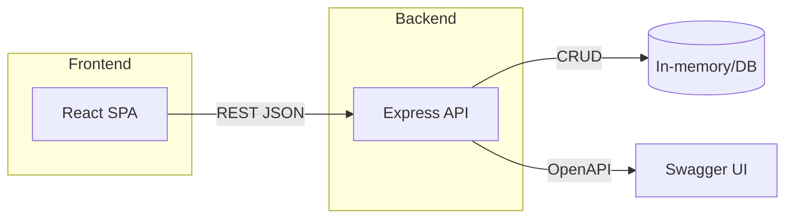

# CCEP MACH Microservice Exercise

Candidate Name: YOUR NAME HERE

## Setup

### Backend
```bash
cd backend
npm install
npm run dev
# API at http://localhost:3000, docs at http://localhost:3000/api-docs
```

### Frontend
```bash
cd frontend
npm install
npm run dev
# App at http://localhost:5173 (set VITE_API_BASE if backend not on default)
```

## Usage
- CRUD endpoints under `/api/health-goals`
- Swagger UI at `/api-docs`

## Design Decisions
- Resource: Health Goal with fields: `id, name, description?, target, unit, deadline?, createdAt, updatedAt`
- In-memory store for simplicity; easy to swap for DB behind a repository interface
- Validation with Joi, centralized error handler
- Express 5 with structured `routes`, `validation`, `setup`

## MACH Principles
- **Microservices**: Backend is a standalone service with clear API surface
- **API-first**: OpenAPI spec exposed via Swagger UI; contract-first design
- **Cloud-native**: Stateless service, env-driven config, suitable for containers
- **Headless**: React frontend decoupled, communicates over HTTP API

## API Reference
- `POST /api/health-goals` Create goal
- `GET /api/health-goals` List goals
- `PUT /api/health-goals/{id}` Update goal
- `DELETE /api/health-goals/{id}` Delete goal

See Swagger at `/api-docs`.

## Testing
```bash
cd backend
npm test
```

## Diagram
See `docs/architecture.mmd` (also embedded below):



## Deployment

### Docker (local compose)
```bash
docker compose up --build
# Frontend at http://localhost:5173
# Backend at http://localhost:3000 (Swagger at /api-docs)
```

### Backend image (standalone)
```bash
cd backend
docker build -t health-goals-backend .
docker run -p 3000:3000 --env NODE_ENV=production health-goals-backend
```

### Frontend image (standalone)
```bash
cd frontend
docker build -t health-goals-frontend .
docker run -p 5173:80 -e VITE_API_BASE=http://localhost:3000 health-goals-frontend
```

Cloud deployment would use these images on a platform like AWS ECS/Fargate, Azure App Service, or GCP Cloud Run.

## CI/CD
- GitHub Actions workflow at `.github/workflows/ci.yml`:
  - Installs and runs backend tests (Jest/Supertest)
  - Builds frontend (Vite)
  - Builds Docker images for backend and frontend
- To push images to a registry, add `DOCKERHUB_USERNAME`/`DOCKERHUB_TOKEN` or cloud registry secrets and set `push: true` in the Docker build steps with `tags` pointing to your registry.
